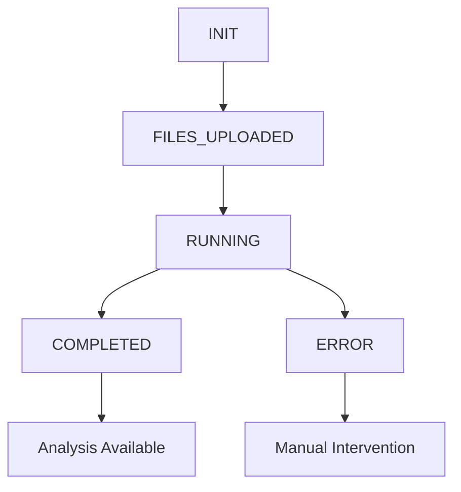

# Research Analysis Backend - Architecture Documentation

## Overview

The Research Analysis Backend is a FastAPI-based system that processes user research interview transcripts through an agentic workflow to generate affinity maps and research findings reports. The system provides a REST API for session management, file uploads, and workflow orchestration.

## Technology Stack

### Core Framework
- **FastAPI**: Modern, fast web framework for building APIs with Python
- **Python 3.12+**: Runtime environment
- **Pydantic v2**: Data validation and settings management
- **Uvicorn**: ASGI server for production deployment

### Data Storage
- **MongoDB**: Primary database for session data and metadata
- **Amazon S3**: Object storage for transcript files (LocalStack for development)

### Development Tools
- **Docker & Docker Compose**: Containerization and local development
- **Ruff**: Python linting and formatting
- **pytest**: Testing framework

## Directory Structure

```
app/
├── common/                 # Shared utilities and infrastructure
│   ├── exceptions.py       # Custom exception classes
│   ├── errors.py          # Error handling middleware
│   ├── s3.py              # S3 client utilities
│   ├── mongo.py           # MongoDB client setup
│   ├── tracing.py         # Request tracing middleware
│   └── ...
├── research_analysis/      # Core business domain
│   ├── models.py          # Pydantic models and schemas
│   ├── repository.py      # Database operations
│   ├── service.py         # Business logic layer
│   ├── router.py          # FastAPI routes
│   └── workflow.py        # Background workflow orchestration
├── health/                 # Health check endpoints
├── main.py                # Application entry point
└── config.py              # Configuration management
```

## Data Model

### Collections

#### `research_analysis`
Primary collection for analysis sessions:

```javascript
{
  "_id": ObjectId,              // Primary key
  "created_at": Date,           // Session creation timestamp
  "status": String,             // INIT | FILES_UPLOADED | RUNNING | COMPLETED | ERROR
  "error_message": String,      // Error description (nullable)
  "agent_state": {              // LangGraph workflow state
    "process_start_date": Date,
    "transcripts": [String],    // Raw transcript content
    "transcripts_pii_cleaned": [String], // PII-scrubbed content
    "affinity_map": String,     // Generated affinity map (markdown)
    "findings_report": String,  // Generated findings report (markdown)
    "status": String,          // Fine-grained workflow status
    "error_message": String    // Workflow-specific errors
  }
}
```

#### `analysis_file`
File metadata collection:

```javascript
{
  "_id": ObjectId,              // Primary key
  "analysis_id": ObjectId,      // Foreign key to research_analysis
  "s3_key": String,            // S3 object key
  "uploaded_at": Date          // Upload timestamp
}
```

### Database Indexes
- `research_analysis.status` - Query optimization for status-based filtering
- `analysis_file.analysis_id` - One-to-many relationship queries
- `research_analysis.created_at` - Sorting for list operations

## API Design

### REST Endpoints

#### Session Lifecycle Management
- `POST /api/v1/research-analyses` - Create new analysis session
- `GET /api/v1/research-analyses` - List all sessions (summary view)
- `GET /api/v1/research-analyses/{id}` - Get specific session with full state
- `PATCH /api/v1/research-analyses/{id}` - Update session status
- `DELETE /api/v1/research-analyses/{id}` - Delete session and files

#### Transcript File Management
- `POST /api/v1/research-analyses/{id}/transcripts` - Upload transcript files
- `GET /api/v1/research-analyses/{id}/transcripts` - List uploaded transcripts

### Response Models

#### Standard Success Response
```json
{
  "_id": "string",
  "created_at": "datetime",
  "status": "enum",
  "error_message": "string|null",
  "agent_state": "object|null"
}
```

#### Standard Error Response
```json
{
  "status": "ERROR",
  "error_message": "string",
  "code": "string" // Optional machine-readable code
}
```

## Component Architecture

### Layered Architecture

```
┌─────────────────────────────────────────────────────────────┐
│                    Presentation Layer                       │
│  ┌─────────────┐  ┌─────────────┐  ┌─────────────────────┐  │
│  │   Router    │  │ Middleware  │  │   Error Handler     │  │
│  │  (FastAPI)  │  │  (Tracing)  │  │   (Standardized)    │  │
│  └─────────────┘  └─────────────┘  └─────────────────────┘  │
└─────────────────────────────────────────────────────────────┘
                              │
┌─────────────────────────────────────────────────────────────┐
│                    Business Logic Layer                     │
│  ┌─────────────┐  ┌─────────────┐  ┌─────────────────────┐  │
│  │   Service   │  │  Workflow   │  │    Validation       │  │
│  │  (Orchestr) │  │ (LangGraph) │  │   (File Types)      │  │
│  └─────────────┘  └─────────────┘  └─────────────────────┘  │
└─────────────────────────────────────────────────────────────┘
                              │
┌─────────────────────────────────────────────────────────────┐
│                    Data Access Layer                        │
│  ┌─────────────┐  ┌─────────────┐  ┌─────────────────────┐  │
│  │ Repository  │  │   S3 Client │  │   MongoDB Client    │  │
│  │  (Database) │  │ (File Stor) │  │   (Primary DB)      │  │
│  └─────────────┘  └─────────────┘  └─────────────────────┘  │
└─────────────────────────────────────────────────────────────┘
```

### Dependency Injection

The application uses FastAPI's dependency injection system:

```python
# Database connection
async def get_db() -> AsyncDatabase:
    return client.get_database(config.mongo_database)

# Repository layer
class ResearchAnalysisRepository:
    def __init__(self, db: AsyncDatabase = Depends(get_db)):
        self.db = db

# Service layer
class ResearchAnalysisService:
    def __init__(
        self,
        repository: ResearchAnalysisRepository = Depends(),
        s3_client=Depends(get_s3_client)
    ):
        self.repository = repository
        self.s3_client = s3_client
```

## Workflow Orchestration

### Status State Machine



### LangGraph Workflow Steps

1. **STARTING** - Initialize workflow state
2. **LOADING_TRANSCRIPTS** - Fetch files from S3
3. **REMOVING_PII** - Process transcripts to remove PII
4. **VALIDATING_PII** - Validate PII removal completion
5. **GENERATING_AFFINITY_MAP** - Create affinity map from transcripts
6. **GENERATING_FINDINGS** - Generate research findings report
7. **FINISHED** - Mark workflow as complete

### Background Processing

```python
# Async workflow execution
asyncio.create_task(start_analysis_workflow(analysis_id, repository))

# Workflow state tracking
await repository.update_agent_state(analysis_id, agent_state.dict())
```

## Error Handling Strategy

### Exception Hierarchy

```python
AppException (Base)
├── NotFoundError (404)
├── ValidationError (400)
│   ├── UnsupportedFileTypeError
│   └── InvalidStatusError
└── ConflictError (409)
```

### Centralized Error Middleware

```python
class ErrorHandlerMiddleware(BaseHTTPMiddleware):
    async def dispatch(self, request: Request, call_next):
        try:
            return await call_next(request)
        except AppException as e:
            # Convert to standardized response
            return JSONResponse(...)
```

### Error Response Format

All errors follow a consistent format:
- HTTP status codes reflect error classification
- JSON body with `status`, `error_message`, and optional `code`
- Detailed logging server-side without exposing internals

## Configuration Management

### Environment-based Configuration

```python
class AppConfig(BaseSettings):
    # MongoDB
    mongo_uri: str = "mongodb://127.0.0.1:27017/"
    mongo_database: str = "ai-sdlc-agentic-ucd-backend"

    # S3 Configuration
    s3_bucket_name: str = "research-analysis-bucket"
    localstack_endpoint: Optional[str] = None
    aws_region: str = "eu-west-2"

    # Application
    port: int = 8085
    tracing_header: str = "x-cdp-request-id"
```

### Environment Variables

- `MONGO_URI` - MongoDB connection string
- `LOCALSTACK_ENDPOINT` - LocalStack endpoint for S3 and other AWS services
- `AWS_REGION` - AWS region configuration
- `AWS_ACCESS_KEY_ID` - AWS credentials
- `AWS_SECRET_ACCESS_KEY` - AWS credentials

## File Storage Strategy

### S3 Key Pattern
```
research/{analysis_id}/{uuid}-{safe_filename}
```

### File Validation
- **Allowed Extensions**: `.md`, `.txt`
- **Allowed MIME Types**: `text/markdown`, `text/plain`
- **Size Limits**: Handled by FastAPI/Uvicorn
- **Content Validation**: UTF-8 encoding required

### File Lifecycle
1. Upload → S3 storage + database record
2. Processing → Content loaded into workflow state
3. Deletion → S3 cleanup + database removal

## Security Considerations

### Current Implementation
- **No Authentication**: Public API for prototype phase
- **Input Validation**: Strict file type and content validation
- **SQL Injection Prevention**: MongoDB with Pydantic validation
- **Path Traversal Prevention**: UUID-based S3 keys

### Future Enhancements
- JWT-based authentication
- Rate limiting
- File content scanning
- Encryption at rest
- Audit logging

## Performance Considerations

### Database Optimization
- Strategic indexes on query-heavy fields
- Projection queries for list operations (exclude large fields)
- Connection pooling via AsyncMongoClient

### File Processing
- Streaming uploads to S3
- Asynchronous workflow processing
- Background task execution

### Memory Management
- Streaming file operations
- Lazy loading of large documents
- Proper cleanup in error scenarios

## Monitoring and Observability

### Structured Logging
```python
logger.info("Created research analysis: %s", analysis.id)
logger.error("Workflow failed for analysis %s: %s", analysis_id, e)
```

### Request Tracing
- `x-cdp-request-id` header propagation
- Context variables for request correlation
- HTTP request/response logging

### Metrics (Prepared for CloudWatch)
- Analysis creation/completion rates
- File upload success/failure rates
- Workflow execution times
- Error rates by endpoint

## Development Environment

### Local Setup
```bash
# Start all services
docker compose up --build -d

# Development with hot reload
docker compose watch
```

### Service Dependencies
- **MongoDB**: Document storage
- **LocalStack**: S3 simulation
- **Application**: FastAPI service

### Testing Strategy
- **Integration Testing**: Full API endpoint testing
- **Docker Environment**: Consistent development/production parity
- **Mock Services**: LocalStack for AWS services

## Deployment Architecture

### Container Strategy
```dockerfile
# Multi-stage build
FROM python:3.12-slim AS base
# Dependencies installation
# Application code copy
# Non-root user execution
```

### Health Checks
- `/health` endpoint for container orchestration
- MongoDB connection validation
- S3 service availability checks

### Configuration Management
- Environment variable injection
- Secrets management via compose files
- Service discovery through Docker networking

## Future Enhancements

### Scalability
- Horizontal scaling with load balancers
- Database read replicas
- Distributed file processing

### Features
- WebSocket support for real-time status updates
- Batch processing capabilities
- Advanced analytics and reporting
- Integration with external LangGraph services

### Infrastructure
- Kubernetes deployment
- Automated CI/CD pipelines
- Monitoring dashboards
- Backup and disaster recovery
